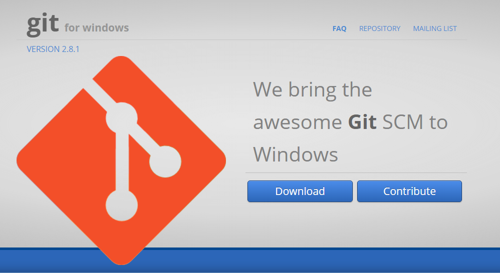
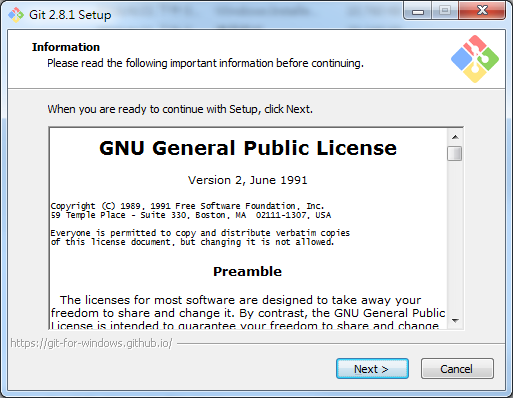
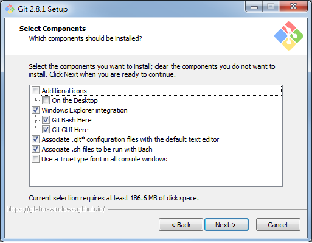
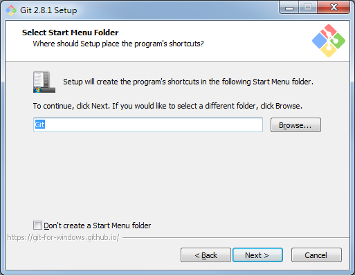
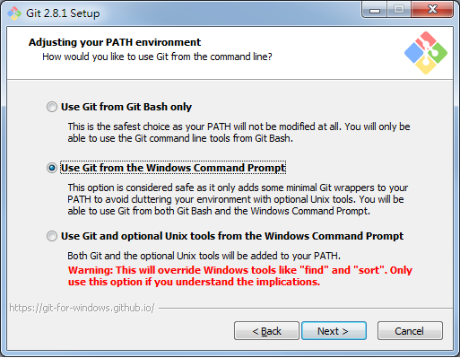
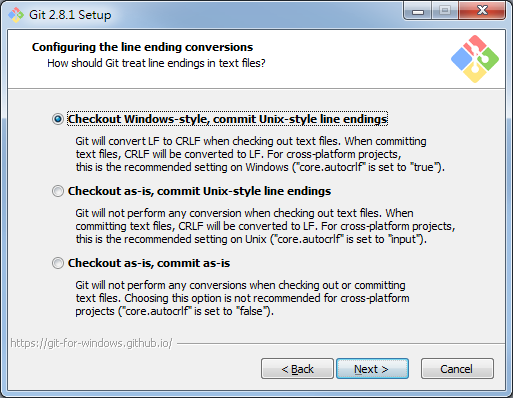
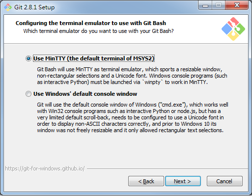
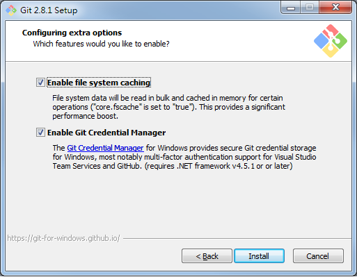
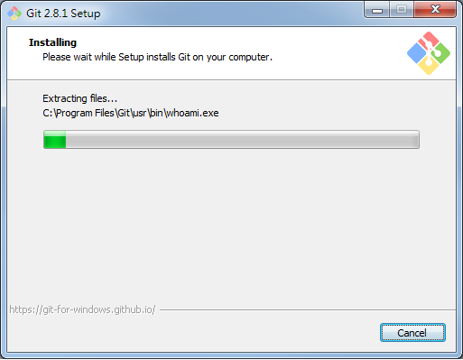
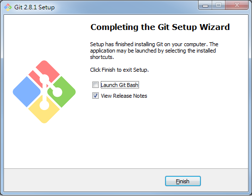

# 安裝Git for Windows
## 先到[官網下載](https://git-for-windows.github.io/)安裝程式

## 雙擊安裝程式開始安裝

## 選擇安裝路徑

## 選擇安裝元件

## 輸入開始功能表的資料夾名稱

## 調整環境路徑

## 設定文件的結尾符號

## 設定命令列模式

## 設定快取

## 開始安裝

## 安裝完成
