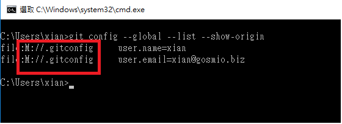
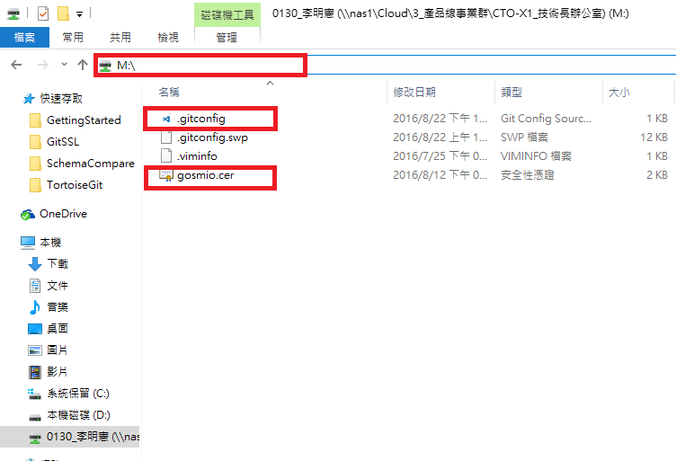

# Git的SSL憑證修改

## 存取內部git server會發生SSL錯誤

```shell
SSL certificate problem: unable to get local issuer certificate
```

## 查詢個人SSL憑證檔位置

```shell
$ git config --global --list --show-origin
```



## gosmio的CA憑證

```code
-----BEGIN CERTIFICATE-----
MIIDgjCCAmqgAwIBAgIQDsJUsG80eI9ENIrVJnanRjANBgkqhkiG9w0BAQsFADBI
MRMwEQYKCZImiZPyLGQBGRYDYml6MRYwFAYKCZImiZPyLGQBGRYGZ29zbWlvMRkw
FwYDVQQDExBnb3NtaW8tQ0FTUlYyLUNBMCAXDTE1MTEwNDAxNDYwM1oYDzIxMTUx
MTA0MDE1NjAyWjBIMRMwEQYKCZImiZPyLGQBGRYDYml6MRYwFAYKCZImiZPyLGQB
GRYGZ29zbWlvMRkwFwYDVQQDExBnb3NtaW8tQ0FTUlYyLUNBMIIBIjANBgkqhkiG
9w0BAQEFAAOCAQ8AMIIBCgKCAQEAx1X6k3RVZT15M+S68U732+simQJDY8UdpNpP
Bj0P6TNxyNwnBJpbJwKd9ys/a+rCIwuHzbMfxf23jj23CykdCHnQJOt2/tqO91/5
Tc/WjggfzCO0mb2nBRe9tqLT0mqZW78Ohg2XXbFdvRJxADpuOJcCbbLCuBuIVw4U
fOdgsLfQ+6DdqQiLuFdUR1qW5IQNcA4KjQYFwJL52y/oeMM2SAoODqBZpU+o3T5I
x9GRDH1SVtHkacJfhDyGVV8O/dW1SNH868jFKsRBZjHnABXXw5IJU6gV7wSBwLwU
tZoXYCCtsSI6gDfyyLcKPdeUmRChgKVqNsr2SCMwW6YYzxYReQIDAQABo2YwZDAT
BgkrBgEEAYI3FAIEBh4EAEMAQTALBgNVHQ8EBAMCAYYwDwYDVR0TAQH/BAUwAwEB
/zAdBgNVHQ4EFgQUbzSVENF9DBIBa0HBr/MhL5u2sv8wEAYJKwYBBAGCNxUBBAMC
AQAwDQYJKoZIhvcNAQELBQADggEBADAoOx7Q7S3DEZZModnbElD4DXGGPHDfCtvG
9Vg/I+TkXOMgveAbMRCyNSvs05x9EiJ98r1qq6f5XiXdQAjPn4V59zaqm8gvTrfn
B4Rg4Fa7caY5y1Rpo6XtFj1PmK+3oqEQ2K42lyhTwZaAT1dLNZWN7pU47BmXi08K
z9UQUFgXRexHFHtcosAl/Y5fTqIjQZ4WBE87itVlIlOpn7HTU3C/tIM7SIFWP/PD
H50MD66YQorEidylZCePa1OahXT15glu2FaOjaLl8AKpsw8QBHFJ8iqSnojuxsCs
JpIv/CHG/IQ1gx8Rj2EeVuC3tjp1GnLTvZ3mOqq5OVOckAnCyiA=
-----END CERTIFICATE-----
```

## 另存新檔為gosmio.cer



## 依個人資料夾位置調整設定

```shell
$ git config --global http."https://www.git.xsg/".sslCAInfo M:\gosmio.cer
```